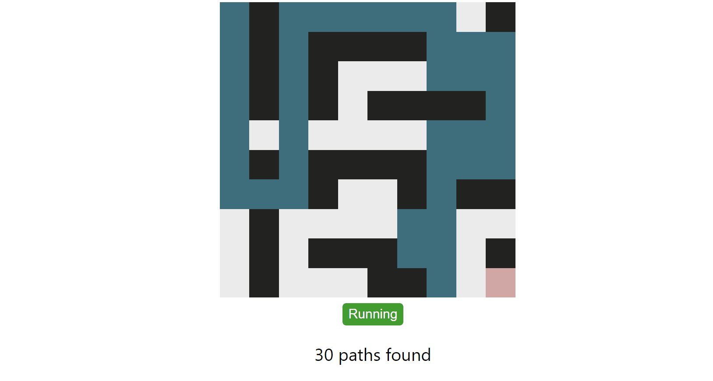
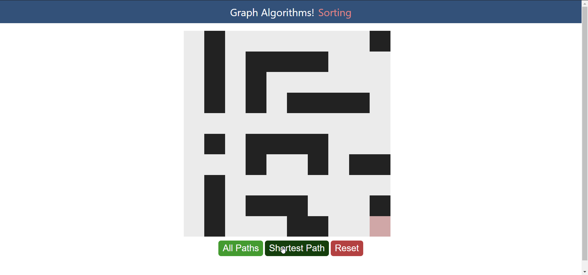
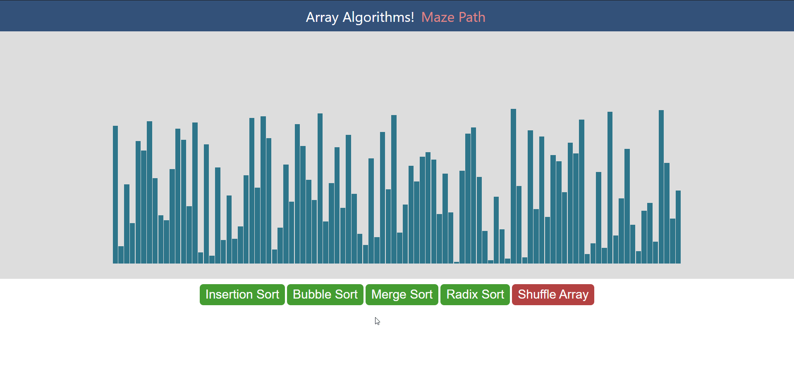
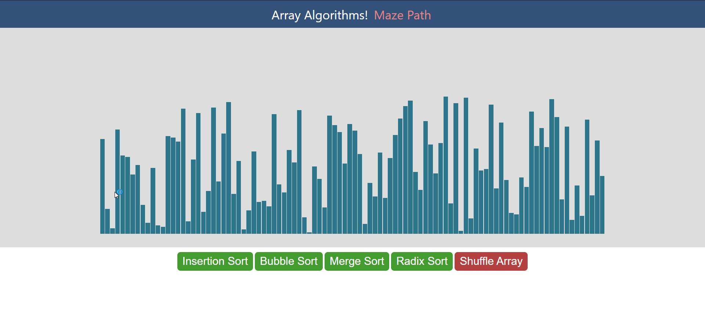
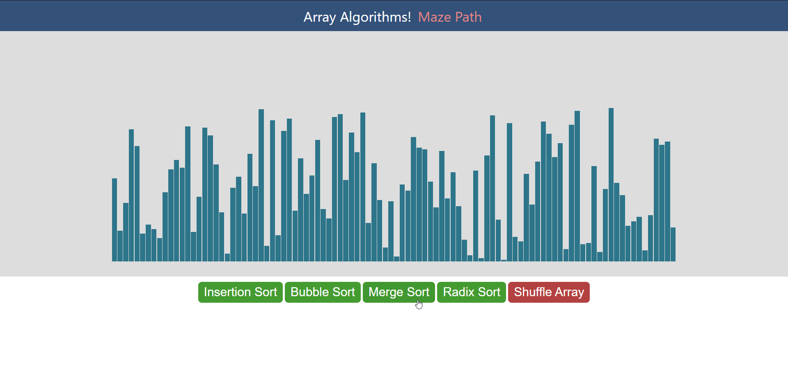
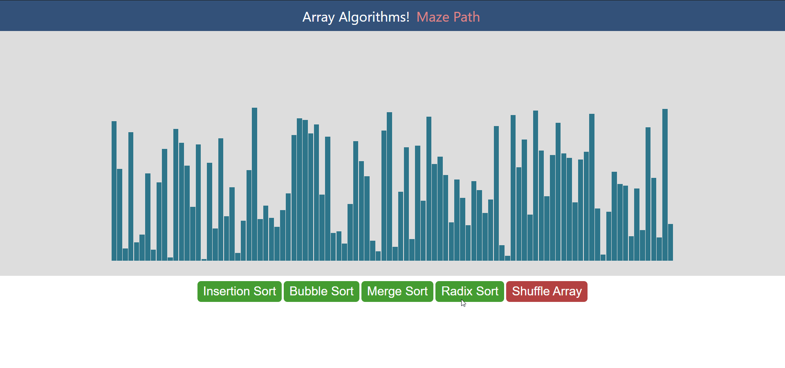

# algorithm-html-project

[Try Yourself Here](https://ashutosh-nsut.github.io/algorithm-html-project/index.html)

## GRAPH ALGORITHMS

### 1. All Paths, Source to Destination

The algorithm used here is `Backtracking`.  
We recursively call for next step in top, left, down, right of current cell and visit it if it's inside maze and is not an obstacle.  This will follow a path and check if the path reaches the destination or not. If the path does not reach the destination then backtrack and try other paths.

### 2. Shortest Path, Source to Destination

The algorithm used here is `Breadth First Search`  
To find the shortest path, all you have to do is start from the source and perform a breadth first search and stop when you find your destination cell. 

 
 

## SORTING ALGORITHMS

A Sorting Algorithm is used to rearrange a given array or list elements according to a comparison operator on the elements. The comparison operator is used to decide the new order of element in the respective data structure.

### 1. Bubble Sort

Bubble Sort is the simplest sorting algorithm that works by repeatedly swapping the adjacent elements if they are in wrong order.

### 2. Insertion Sort

Insertion sort is a simple sorting algorithm that works similar to the way you sort playing cards in your hands. The array is virtually split into a sorted and an unsorted part. Values from the unsorted part are picked and placed at the correct position in the sorted part.

### 3. Merge Sort

Merge Sort is a Divide and Conquer algorithm. It divides the input array into two halves, calls itself for the two halves, and then merges the two sorted halves. The merge function is used for merging two halves.

### 4. Radix Sort

The idea of Radix Sort is to do digit by digit sort starting from least significant digit to most significant digit. Radix sort uses counting sort as a subroutine to sort.

